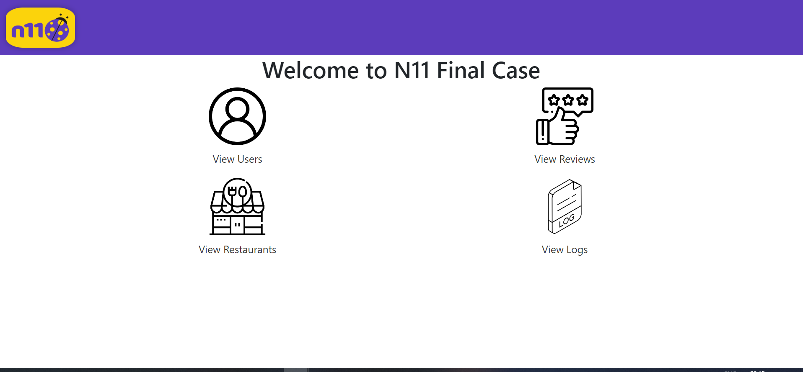

### Docker Compose Installation
To run the application using Docker Compose, follow these steps:

1. Clone the repository:


```bash
    git clone https://github.com/mehmetgencv/n11-TalentHub-Backend-Bootcamp-Final-Case-Frontend
```

2. Navigate to the project directory:

   ```bash
   cd n11-TalentHub-Backend-Bootcamp-Final-Case-Frontend
   ```

3. Build and run the Docker containers:

   ```bash
   docker-compose up -d
   ```

   This command will build the Docker images specified in the `docker-compose.yml` file and start the containers in detached mode.

4. Access the application in your web browser:

   Once the containers are up and running, you can access the application at [http://localhost:8083/](http://localhost:8083/).

5. To stop the containers, run:

   ```bash
   docker-compose down
   ```

   This will stop and remove the containers, networks, and volumes created by `docker-compose up`.

